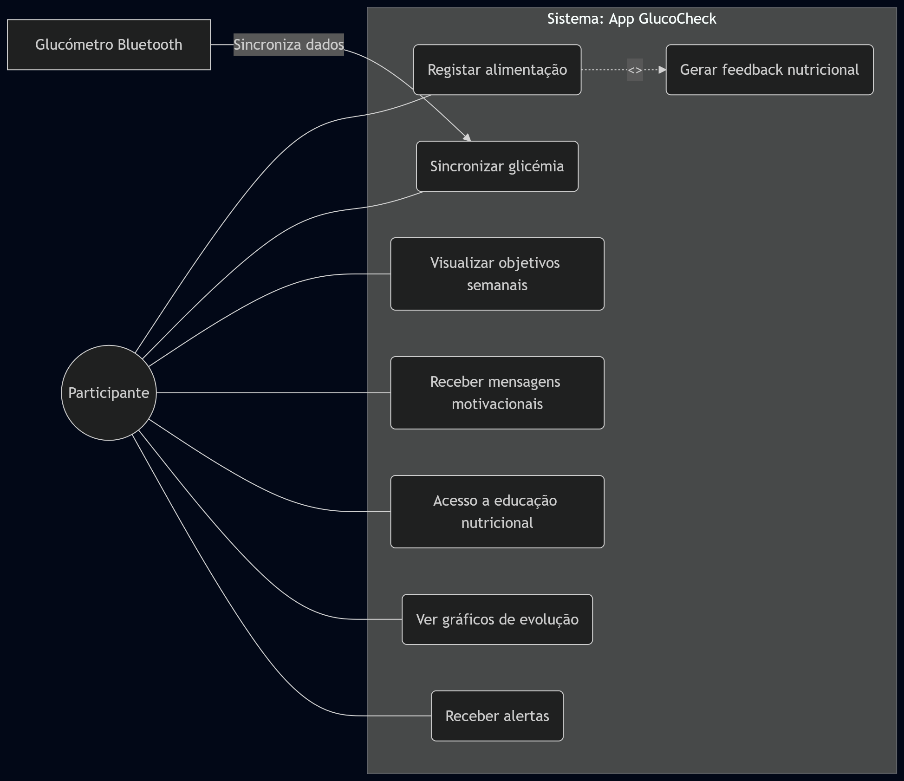
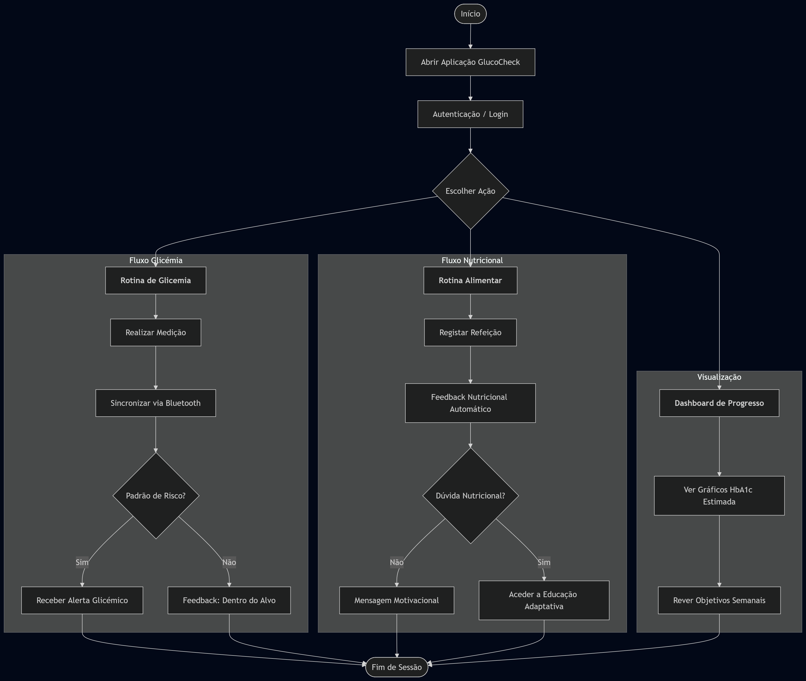

# Protocolo de Ensaio Clínico

## Informação Administrativa

### Título do Estudo

Eficácia da aplicação Glucocheck na otimização do controlo glicémico em pacientes com diabetes Mellitus tipo 2 

### Título Abreviado

GlucoCheck: Controlo Glicémico na DMT2

### Autores e Afiliações

**Investigadores Principais:**
- Diana Lopes, Faculdade de Medicina da Universidade do Porto
- José Ferreira, Faculdade de Medicina da Universidade do Porto
- Rodrigo Oliveira, Faculdade de Medicina da Universidade do Porto
- Tomás Santos, Faculdade de Medicina da Universidade do Porto

**Instituição:**
Faculdade de Medicina da Universidade do Porto

**Contacto:**
Email: up202508158@med.up.pt

### Identificação do Ensaio

**Tipo de estudo:** Ensaio clínico randomizado, controlado, paralelo

**Data de início prevista:** 1 de maio de 2026

**Data de conclusão prevista:** 31 de outubro de 2026

---

## 1. Introdução

### 1.1 Racional

A Diabetes Mellitus Tipo 2 constitui um dos maiores desafios de saúde pública a nível global e em Portugal [@gardetecorreia2010], associando-se a elevada morbilidade e mortalidade cardiovascular quando o controlo metabólico é subótimo. A pedra basilar do tratamento assenta não apenas na terapêutica farmacológica, mas também na modificação sustentada de estilos de vida e na monitorização contínua. Contudo, a inércia clínica e a falta de adesão dos doentes ao regime terapêutico e dietético fora do ambiente clínico tradicional resultam frequentemente na falência da consecução dos alvos terapêuticos, nomeadamente a manutenção da hemoglobina glicada em níveis seguros. A abordagem clínica convencional, baseada em consultas periódicas, revela-se insuficiente para colmatar a necessidade diária de tomada de decisões que a doença exige.

Nas últimas décadas, a saúde digital tem demonstrado potencial para transformar a gestão de patologias crónicas [@greenwood2017]. A evidência científica atual sugere que intervenções baseadas em aplicações móveis de saúde podem facilitar a automonitorização, fornecer feedback em tempo real e aumentar o conhecimento em saúde. Estudos preliminares indicam que o uso de plataformas digitais interativas está associado a reduções clinicamente significativas da hemoglobina glicada e a melhorias na autoeficácia [@quinn2011; @hou_mobile_2016]. Estas ferramentas tecnológicas operam através do reforço positivo e do suporte educacional contínuo, elementos que potenciam a capacitação do doente para gerir a sua condição entre as consultas médicas convencionais, otimizando os resultados clínicos de forma custo-efetiva.

Apesar do aumento exponencial no desenvolvimento de aplicações móveis para a diabetes, existe uma escassez de ensaios clínicos randomizados com robustez metodológica que validem a eficácia de plataformas específicas, como a aplicação GLUCOCHECK, face aos cuidados habituais isolados. A maioria das aplicações disponíveis comercialmente carece de validação empírica rigorosa e frequentemente não integra múltiplos determinantes do controlo glicémico, como a adesão simultânea ao registo alimentar, monitorização glicémica e avaliação formal da autoeficácia através de instrumentos validados como a Diabetes Empowerment Scale Short Form [@anderson2003]. Subsiste, portanto, a necessidade crítica de quantificar o impacto isolado da integração desta tecnologia de forma controlada.

O presente ensaio clínico randomizado visa preencher esta lacuna na literatura, avaliando rigorosamente a eficácia da aplicação GLUCOCHECK em comparação com a consulta habitual isolada, que se limita a consultas trimestrais e aconselhamento standard sem suporte digital. O objetivo primário é determinar o impacto da intervenção na redução da hemoglobina glicada aos seis meses de seguimento. Secundariamente, pretende-se avaliar as alterações na glicemia em jejum, no peso corporal, na adesão ao registo alimentar e na frequência de monitorização glicémica, bem como quantificar o incremento na autoeficácia, no conhecimento sobre a patologia e na satisfação global com os cuidados de saúde prestados.

### 1.2 Objetivos

#### Objetivo Primário

O objetivo primário deste ensaio clínico randomizado é avaliar se a utilização da aplicação móvel GlucoCheck, em adição aos cuidados habituais em cuidados de saúde primários, conduz a uma melhoria do controlo glicémico em adultos com diabetes mellitus tipo 2 e controlo metabólico subótimo, comparativamente aos cuidados habituais isolados. A eficácia da intervenção será determinada pela diferença na hemoglobina glicada (HbA1c) aos seis meses de seguimento entre os participantes que utilizam a aplicação e aqueles que recebem apenas o acompanhamento clínico habitual.

#### Objetivos Secundários

Os objetivos secundários deste estudo consistem em avaliar o impacto da intervenção em diversos indicadores clínicos e comportamentais, nomeadamente:

* **Parâmetros Clínicos:** Avaliar as alterações na glicemia em jejum e no peso corporal dos participantes ao longo dos 6 meses.
* **Comportamentos de Autogestão:** Analisar a adesão ao registo alimentar e a frequência de monitorização glicémica através dos dados sincronizados pela aplicação GlucoCheck.
* **Autoeficácia:** Mensurar a eficácia na autogestão da diabetes, utilizando a escala *Diabetes Empowerment Scale Short Form* (DES-SF).
* **Literacia em Saúde:** Avaliar o incremento no nível de conhecimento sobre a patologia após a utilização dos módulos educativos da aplicação.
* **Satisfação:** Determinar o nível de satisfação dos participantes com os cuidados recebidos e com a integração da ferramenta digital na sua rotina clínica.

---

## 2. Métodos

### 2.1 Desenho do Estudo

Este é um ensaio clínico randomizado, controlado, de grupos paralelos.

**Características do desenho:**

Este estudo será conduzido como um ensaio clínico randomizado, controlado, de grupos paralelos, com o objetivo de avaliar a eficácia da aplicação móvel GlucoCheck no controlo glicémico de adultos com diabetes mellitus tipo 2 em cuidados de saúde primários. Os participantes elegíveis serão alocados a um de dois grupos: um grupo de intervenção, que terá acesso à aplicação em adição aos cuidados habituais, e um grupo de controlo, que receberá exclusivamente o acompanhamento clínico habitual.

A randomização será realizada numa proporção de 1:1 entre os dois braços do estudo. A sequência de randomização será gerada por método computacional, assegurando a alocação aleatória dos participantes aos grupos de intervenção e controlo, de forma a minimizar potenciais vieses de seleção e garantir comparabilidade entre os grupos no início do estudo.

A duração total do estudo será de seis meses (24 semanas) para cada participante. As avaliações clínicas e de resultados serão realizadas no início do estudo (baseline), aos três meses e aos seis meses de seguimento, permitindo avaliar tanto efeitos intermédios como o impacto final da intervenção no controlo glicémico.

O estudo será realizado numa Unidade de Saúde Familiar (USF) do sistema de cuidados de saúde primários em Portugal. Antes da implementação do ensaio principal, será conduzido um pré-teste piloto com 30 participantes, distribuídos equitativamente entre os dois grupos, com o objetivo de avaliar a viabilidade operacional do protocolo e dos procedimentos de recolha de dados.

**Timeline:**

| Fase | Duração | Descrição |
|------|---------|-----------|
| **Recrutamento** | 4 semanas | Identificação de doentes com DMT2 através da base de dados da USF e convite presencial em consulta. |
| **Baseline (T0)** | 1 semana | Assinatura do consentimento, colheita de HbA1c inicial, randomização e instalação da App GlucoCheck. |
| **Intervenção** | 24 semanas | Utilização diária da app para registo alimentar e sincronização automática de dados do glucómetro via Bluetooth. |
| **Follow-up** | 24 semanas | Avaliação final (6 meses) com nova colheita de HbA1c, medição de peso e preenchimento da escala DES-SF. |

### 2.2 População do Estudo

#### 2.2.1 Critérios de Inclusão

Serão elegíveis para participação neste estudo indivíduos que cumpram **todos** os seguintes critérios:

1. **Diagnóstico Clínico:** Indivíduos com diagnóstico confirmado de Diabetes Mellitus Tipo 2 (DMT2).
2. **Faixa Etária:** Adultos com idade compreendida entre os 40 e os 75 anos inclusive.
3. **Controlo Glicémico:** Valores de hemoglobina glicada (HbA1c) entre 7,0% e 9,5% no momento do recrutamento (últimos 3 meses).
4. **Contexto Assistencial:** Doentes seguidos ativamente em unidades de Cuidados de Saúde Primários.
5. **Literacia Digital e Recursos:** Posse de smartphone com sistema operativo compatível e capacidade demonstrada para navegar em aplicações móveis.
6. **Estabilidade Terapêutica:** Regime de antidiabéticos orais ou análogos do GLP-1 estável nos últimos 3 meses.

#### 2.2.2 Critérios de Exclusão

Serão excluídos do estudo indivíduos que apresentem **qualquer** dos seguintes critérios:

1. **Terapêutica com Insulina:** Utilização de qualquer regime de insulinoterapia (devido ao risco de hipoglicemia e complexidade de ajuste).
2. **Patologias Intercorrentes Graves:** Diagnóstico de insuficiência renal terminal (TFG < 30 mL/min/1.73m²), insuficiência cardíaca classe funcional NYHA III/IV ou doença oncológica ativa.
3. **Diabetes Tipo 1 ou Gestacional:** Exclusão de outras etiologias de diabetes que requerem gestão clínica distinta.
4. **Limitações Cognitivas ou Sensoriais:** Défice cognitivo documentado, perturbação psiquiátrica grave ou limitações visuais/motoras que impossibilitem o uso da app GlucoCheck.
5. **Conflito de Intervenção:** Participação simultânea em outros ensaios clínicos ou utilização prévia de aplicações de gestão de diabetes nos 6 meses anteriores.
6. **Instabilidade Médica Recente:** Internamento hospitalar ou alteração major da medicação antidiabética no último trimestre.

#### 2.2.3 Processo de Recrutamento

O recrutamento dos participantes será realizado na Unidade de Saúde Familiar (USF) através de uma abordagem em duas fases, visando garantir que o tamanho da amostra seja atingido no período previsto:

1. **Identificação e Pré-seleção:** A equipa de investigação, em colaboração com os profissionais da USF, realizará uma pesquisa na base de dados clínica (processo clínico eletrónico) para identificar utentes com diagnóstico de DMT2 (código ICD-10) que cumpram os critérios de idade (40-75 anos) e os valores de HbA1c (7,0% a 9,5%) nos últimos três meses.
2. **Convite e Consentimento:** Os doentes pré-selecionados serão contactados pelos seus médicos de família durante as consultas de rotina ou via contacto telefónico para apresentação dos objetivos do estudo. Aos interessados, será agendada uma consulta de baseline onde um membro da equipa de investigação explicará detalhadamente o protocolo e procederá à assinatura do Consentimento Informado, Livre e Esclarecido antes de qualquer procedimento de colheita de dados.

### 2.3 Intervenções

#### 2.3.1 Grupo de Intervenção

Os participantes randomizados para o grupo de intervenção receberão:

**Aplicação GlucoCheck:**

O grupo de intervenção utilizará a aplicação móvel GlucoCheck, integrada via Bluetooth com um glucómetro digital, enquanto o grupo de controlo manterá o acompanhamento padrão em cuidados de saúde primários, consistindo em consultas trimestrais e educação convencional para a autogestão da diabetes. Dada a faixa etária da coorte, entre os 40 e os 75 anos, a introdução tecnológica será suportada por uma sessão de capacitação presencial inicial de 60 minutos, conduzida por investigadores treinados, onde se procederá à instalação do software e à demonstração prática das funcionalidades. Para mitigar barreiras de literacia digital, será fornecido um manual de utilizador em suporte físico com iconografia de elevado contraste e uma linha de apoio técnico dedicada, garantindo que a proficiência tecnológica não constitua um viés de seleção ou de adesão aos procedimentos do estudo.

A descontinuação da intervenção ou a exclusão do participante ocorrerá mediante critérios de segurança clínica estritos, salvaguardando a integridade física do doente acima dos objetivos experimentais. A transição para terapêutica insulínica, motivada por falha secundária aos antidiabéticos orais ou descompensação glicémica persistente, ditará a interrupção imediata da participação no ensaio, uma vez que altera o perfil metabólico e a complexidade do autocuidado definido no protocolo original. Adicionalmente, o estudo será interrompido para indivíduos que apresentem eventos adversos graves, como episódios de hipoglicemia severa recorrente ou cetoacidose diabética, ou sempre que o médico assistente considere que a permanência no protocolo compromete o ajuste clínico necessário face a uma deterioração aguda do estado de saúde.

A retenção dos participantes e a adesão ao registo alimentar, frequentemente identificado como um elemento de elevada carga cognitiva, serão otimizadas através de estratégias de gamificação e simplificação funcional [@cugelman2013; @johnson_gamification_2016]. A aplicação GlucoCheck incorporará um sistema de reconhecimento de imagem e listas de alimentos frequentes baseadas nas preferências individuais para acelerar a introdução de dados, minimizando o esforço logístico do utilizador. Paralelamente, serão enviadas notificações push personalizadas com reforço positivo e marcos de progresso, enquanto a equipa de investigação realizará contactos telefónicos de cortesia ao terceiro mês para monitorizar o bem-estar e resolver barreiras motivacionais, garantindo que o compromisso com o protocolo se mantém até à avaliação final do desfecho primário aos seis meses.

Quanto à gestão clínica por parte dos médicos de família, é fundamental que a prática terapêutica seja padronizada para evitar confundidores nos níveis de HbA1c. Os clínicos serão instruídos a manter a medicação hipoglicemiante oral estável durante o período do estudo, exceto em situações de risco imediato para o doente, como hipoglicemias sintomáticas ou hiperglicemia refratária que exija intervenção urgente. Qualquer ajuste posológico ou alteração na classe farmacológica deverá ser rigorosamente documentado no processo clínico eletrónico e reportado à equipa de investigação, permitindo uma análise de sensibilidade posterior que contabilize o impacto destas modificações nos resultados finais, assegurando que a eficácia atribuída à aplicação móvel não é mascarada por intervenções farmacológicas concorrentes.

#### Funcionalidades principais:

1. **Integração com glucómetro via Bluetooth**
   - **O que faz:** Permite a sincronização automática das leituras de glicemia para a app.
   - **Interação:** O utilizador liga o Bluetooth e os dados são transferidos sem introdução manual.
   - **Frequência:** Sempre que realizar uma medição glicémica.

2. **Registo alimentar com feedback nutricional automatizado**
   - **O que faz:** Registo de refeições com análise imediata da composição nutricional.
   - **Interação:** O utilizador insere os alimentos e recebe feedback sobre a carga glicémica da refeição.
   - **Frequência:** Após as principais refeições diárias.

3. **Objetivos glicémicos semanais personalizados**
   - **O que faz:** Define metas de controlo baseadas no perfil individual do doente.
   - **Interação:** A app sugere alvos semanais e o utilizador monitoriza o cumprimento no dashboard.
   - **Frequência:** Revisão semanal dos objetivos.

4. **Mensagens motivacionais baseadas em progresso**
   - **O que faz:** Envio de notificações push de reforço positivo conforme os resultados.
   - **Interação:** O utilizador recebe alertas no smartphone que incentivam a manutenção de bons hábitos.
   - **Frequência:** Diária ou conforme marcos de progresso atingidos.

5. **Educação nutricional adaptativa**
   - **O que faz:** Disponibiliza conteúdos educativos que se ajustam às escolhas alimentares do doente.
   - **Interação:** O utilizador acede a módulos de aprendizagem curtos dentro da aplicação.
   - **Frequência:** Sugerida pelo menos duas vezes por semana.

6. **Gráficos de evolução de HbA1c estimada**
   - **O que faz:** Calcula uma estimativa da hemoglobina glicada com base nos dados diários.
   - **Interação:** Visualização de gráficos de tendência para perceber o controlo a longo prazo.
   - **Frequência:** Consulta semanal pelo utilizador.

7. **Alertas para padrões glicémicos problemáticos**
   - **O que faz:** Identifica tendências de hipo ou hiperglicemia recorrentes.
   - **Interação:** A app emite um aviso visual e sonoro quando deteta um padrão de risco.
   - **Frequência:** Ativado automaticamente sempre que os dados saem do "tempo em alvo".

**Instalação e Onboarding:**

A integração dos participantes no braço de intervenção seguirá um protocolo estruturado para garantir a proficiência tecnológica:

* **Processo de Instalação:** A aplicação GlucoCheck será instalada nos smartphones dos participantes pela equipa de investigação durante a consulta de baseline. 
* **Sessão de Capacitação:** Os participantes serão submetidos a uma sessão de capacitação presencial com a duração de 60 minutos, conduzida por investigadores treinados. 
* **Conteúdo do Treino:** Esta sessão incluirá um tutorial prático sobre a navegação no dashboard, o método de registo alimentar e a extração de relatórios médicos.
* **Configuração de Dispositivos:** O onboarding incluirá o emparelhamento via Bluetooth entre o smartphone e o glucómetro digital. 
* **Sincronização:** O utilizador será instruído sobre como validar a transferência de dados e interpretar os sinais de confirmação da app.
* **Material de Apoio:** Será entregue um manual de utilizador em suporte físico com iconografia de elevado contraste.

**Suporte técnico:**

Os participantes terão acesso a uma linha de apoio técnica dedicada para a resolução de problemas de conectividade ou dúvidas na utilização das funcionalidades. Esta linha estará disponível para garantir que a literacia digital não seja uma barreira à adesão.

**Cuidado concomitante:**

Os participantes mantêm o seu cuidado médico habitual, incluindo as consultas trimestrais de acompanhamento na Unidade de Saúde Familiar (USF), o aconselhamento educacional convencional para a autogestão da diabetes e a manutenção do regime estável de medicação antidiabética oral ou análogos do GLP-1.

#### 2.3.2 Grupo Controlo

Os participantes randomizados para o grupo controlo receberão:

O grupo de controlo será submetido ao "Cuidado Habitual" (*Standard of Care*) para a gestão da Diabetes Mellitus Tipo 2 (DMT2) em ambiente de cuidados de saúde primários. Esta intervenção consiste no acompanhamento clínico convencional, focado na gestão farmacológica e educativa standard, sem a integração de ferramentas digitais de monitorização ativa, sincronização automática de dados ou feedback em tempo real através de aplicações móveis.

**Cuidado Habitual:**

* **O que recebem:** Consultas de seguimento médico e de enfermagem focadas no ajuste da terapêutica oral e aconselhamento sobre estilos de vida. O suporte educativo é fornecido exclusivamente através de materiais tradicionais em suporte de papel (folhetos informativos).
* **Com que frequência:** As consultas de rotina são realizadas com periodicidade trimestral.
* **Que contactos têm:** Serão realizados dois contactos presenciais de rotina na Unidade de Saúde Familiar (USF) durante os 6 meses do acompanhamento. Adicionalmente, os participantes realizam colheitas de sangue laboratoriais para medição da HbA1c nos mesmos momentos que o grupo de intervenção: no início (*baseline*), aos 3 meses e aos 6 meses.

**Justificação do comparador:**

A escolha do cuidado habitual justifica-se por representar o atual padrão de tratamento (*standard of care*) para doentes com DMT2 no sistema de saúde português, garantindo que nenhum participante recebe um nível de cuidado inferior ao recomendado eticamente pelas diretrizes nacionais. De acordo com a norma SPIRIT 2013 [@chan2013], o uso deste comparador permite avaliar a eficácia incremental e a utilidade real da aplicação GlucoCheck face à prática clínica convencional.

#### 2.3.3 Critérios de Descontinuação

Participantes serão retirados do estudo se:

1. **Retirada de Consentimento:** O participante manifestar o desejo de interromper a sua participação no ensaio clínico, em qualquer fase do estudo, sem necessidade de justificação.
2. **Alteração da Condição Clínica / Segurança:** Ocorrer uma descompensação glicémica persistente que exija a transição para terapêutica insulínica, ou a ocorrência de eventos adversos graves, tais como episódios de hipoglicemia severa recorrente ou cetoacidose diabética, que tornem a participação insegura.
3. **Violação do Protocolo:** Se verificar o abandono da utilização da aplicação GlucoCheck por um período prolongado (superior a 4 semanas consecutivas) ou se houver alterações na medicação antidiabética oral sem o conhecimento e documentação prévia da equipa de investigação.

---

## 3. Avaliações e Outcomes

### 3.1 Outcome Primário

**Variação da Hemoglobina Glicada (HbA1c)**

- **Instrumento:** A medição será realizada através de uma colheita de sangue venoso por profissionais de saúde qualificados na Unidade de Saúde Familiar (USF). A análise laboratorial será efetuada por cromatografia líquida de alta performance (HPLC), seguindo os padrões certificados pelo *National Glycohemoglobin Standardization Program* (NGSP).
- **Momento de avaliação:** As avaliações serão realizadas no início do estudo (*baseline*), aos 3 meses (T12 semanas) e no final da intervenção, aos 6 meses (T24 semanas).
- **Definição de sucesso:** O sucesso será definido pela redução média estatisticamente significativa da HbA1c no grupo de intervenção (GlucoCheck) em comparação com o grupo de controlo aos 6 meses. Considera-se um impacto clinicamente relevante uma redução igual ou superior a 0,5% no valor da HbA1c.

### 3.2 Outcomes Secundários

1. **Autoeficácia na gestão da diabetes:**
   - **Instrumento:** Escala *Diabetes Empowerment Scale Short Form* (DES-SF), validada para a população portuguesa [@aveiro_fiability_2015].
   - **Momento:** Aplicada no *baseline* e aos 6 meses.
   
2. **Glicemia em Jejum e Peso Corporal:**
   - **Instrumento:** Medição laboratorial da glicemia em jejum e pesagem em balança médica calibrada na USF para cálculo do IMC.
   - **Momento:** Avaliados no *baseline*, aos 3 meses e aos 6 meses.

3. **Comportamentos de Autogestão e Adesão:**
   - **Instrumento:** Frequência de utilização da aplicação GlucoCheck, número de registos alimentares concluídos e regularidade da sincronização de dados do glucómetro.
   - **Momento:** Monitorização contínua através dos dados extraídos da aplicação durante as 24 semanas de intervenção.

## 4. Análise Estatística

### 4.1 Justificação da Amostra (Estudo Piloto)
Sendo este um estudo piloto focado na viabilidade da aplicação **GlucoCheck**, o tamanho da amostra foi fixado em **n=30** (15 por braço). Esta dimensão baseia-se na "Regra de Julious" [@julious2005] para ensaios clínicos piloto, que sugere 12 a 15 participantes por grupo como o mínimo necessário para estimar a variância e avaliar a exequibilidade do protocolo. Os resultados obtidos servirão para fundamentar o cálculo do poder estatístico de um futuro ensaio clínico de confirmação (Fase III).

### 4.2 Análise do Outcome Primário: Eficácia Glicémica
O objetivo principal é avaliar a redução da **HbA1c** entre o *baseline* ($T_0$) e os 6 meses de intervenção ($T_6$).

* **População de Análise:** Utilizar-se-á uma abordagem de **Intenção de Tratar (ITT)**, incluindo todos os participantes que iniciaram o estudo, independentemente do seu nível de interação com a App.
* **Modelo Estatístico:** Para comparar a eficácia entre os grupos, aplicaremos uma **ANCOVA (Análise de Covariância)**, utilizando o valor final da HbA1c como variável dependente e o valor inicial como covariável. Esta técnica permite isolar o efeito real da aplicação GlucoCheck, corrigindo as diferenças individuais iniciais.
* **Magnitude do Efeito:** Dada a amostra reduzida ($n < 50$), utilizaremos o **g de Hedges** em vez do d de Cohen [@lakens2013], por ser um estimador menos enviesado para estudos piloto. O cálculo seguirá a equação:

$$g = \frac{M_{int} - M_{cont}}{SD_{agrupado}} \times \left( 1 - \frac{3}{4(n_1 + n_2) - 9} \right)$$

> **Legenda:** > * $M_{int}$ e $M_{cont}$ são as médias de variação da HbA1c.
> * O fator multiplicador final representa a correção para o enviesamento de amostras pequenas.

### 4.3 Análise de Outcomes Secundários e Usabilidade
* **Controlo Glicémico Diário:** A variável "Tempo em Alvo" (*Time in Range*) [@battelino2019], obtida por sincronização Bluetooth, será comparada através do teste de **Mann-Whitney**, ajustado para dados não paramétricos.
* **Engagement e Adesão:** No grupo de intervenção, será calculada a correlação de Spearman entre o número de registos nutricionais diários e a variação da glicemia em jejum.
* **Segurança e Retenção:** A taxa de abandono (*dropout*) e a frequência de episódios de hipoglicemia serão comparadas entre grupos utilizando o **Teste Exato de Fisher**, devido às baixas frequências esperadas numa amostra de 30 pessoas.
* **Nível de Significância:** Todos os testes serão bilaterais com um valor de $\alpha = 0.05$.

---

## 5. Ética e Disseminação

### 5.1 Aprovação Ética e Normas de Conduta
O presente protocolo foi desenhado em conformidade com a Declaração de Helsínquia e as diretrizes SPIRIT [@chan2013]. O projeto será submetido para apreciação e aprovação da **Comissão de Ética da Faculdade de Medicina da Universidade do Porto (FMUP)**. Qualquer alteração substancial no desenho do ensaio ou nos procedimentos de segurança será comunicada e aprovada via adenda antes de ser implementada no terreno.

### 5.2 Processo de Consentimento Informado
A inclusão de cada participante será precedida pela obtenção de um consentimento informado, esclarecido e livre.

* **Esclarecimento:** Durante a consulta inicial, o investigador apresentará a Folha de Informação ao Participante, detalhando os benefícios esperados do GlucoCheck e a natureza mínima dos riscos envolvidos.
* **Voluntariado:** Será explicitado que a participação é estritamente voluntária e que a desistência em qualquer fase do estudo não terá qualquer impacto negativo na qualidade dos cuidados de saúde prestados ao doente na sua unidade de saúde.
* **Formalização:** O consentimento será formalizado através de assinatura digital encriptada na interface de *onboarding* da aplicação, após confirmação de leitura integral dos termos.

### 5.3 Privacidade, Confidencialidade e RGPD
O tratamento de dados seguirá rigorosamente o **Regulamento Geral sobre a Proteção de Dados (RGPD)** vigente na União Europeia.

* **Pseudonimização:** Os dados clínicos (HbA1c e registos glicémicos) serão dissociados da identidade do participante através de um código alfanumérico único. A tabela de correspondência será mantida num servidor isolado, sob responsabilidade exclusiva do Investigador Principal.
* **Cibersegurança:** A comunicação entre o glucómetro, a aplicação móvel e a base de dados central utilizará protocolos de segurança TLS/SSL. O armazenamento será efetuado em infraestrutura de nuvem com certificação para dados de saúde.

### 5.4 Monitorização de Segurança e Vigilância Clínica
Dada a natureza da Diabetes Tipo 2, o sistema GlucoCheck incorpora mecanismos de mitigação de risco metabólico:

* **Alertas Críticos:** O sistema gerará notificações automáticas imediatas para o participante e para a equipa médica sempre que forem detetados valores de hipoglicemia severa (< 54 mg/dL) ou hiperglicemia extrema (> 300 mg/dL).
* **Intervenção de Resgate:** Perante um alerta crítico persistente ou uma tendência de agravamento reportada pela app, o protocolo prevê o contacto direto por parte da equipa clínica num prazo máximo de 12 horas para ajuste terapêutico ou encaminhamento para o serviço de urgência.

### 5.5 Estratégia de Disseminação
Os resultados serão partilhados de forma transparente, independentemente de confirmarem ou não a eficácia da intervenção:
* **Publicação Académica:** Submissão de um artigo científico a revistas de referência em *Digital Health* ou Diabetologia (ex: *JMIR* ou *Diabetes Care*), seguindo as normas CONSORT-EHEALTH [@eysenbach2011].
* **Transferência de Conhecimento:** Apresentação dos resultados em congressos nacionais da Sociedade Portuguesa de Diabetologia [@spd2023diabetes].
* **Retorno aos Participantes:** No final dos 6 meses, os participantes receberão um infográfico individual resumindo a evolução do seu controlo glicémico e os resultados globais do estudo.

---

## 6. Referências

::: {#refs}
:::

---

**Versão:** 1.0  
**Data desta versão:** 26/03/2026  
**Autores desta versão:** Diana Lopes, José Ferreira, Rodrigo Oliveira, Tomás Santos
